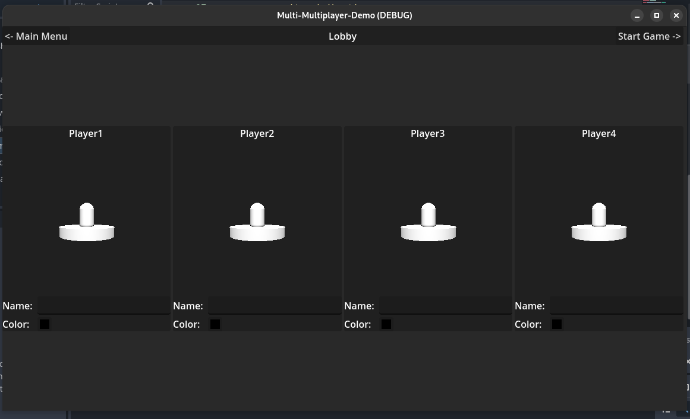
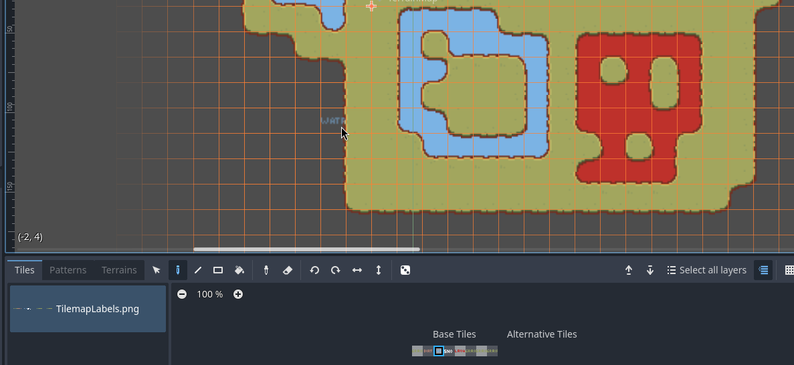

This project is aimed at being a gameplay agnostic collection of Multiplayer assets. 

I don't like recreating things, so I try to make reusable components for future projects. 

Feel free to use these assets in your project, but be sure to give proper credit ... or else!

# Screenshots
## Start Screen

## 4 Person Lobby

## TerrainMap
This Terrain Map borrow HEAVILY from 
[Dual-Tilemap-System from Jess-Hammer](https://github.com/jess-hammer/dual-grid-tilemap-system-godot) 
and [jess::codes video on Youtube](https://www.youtube.com/watch?v=jEWFSv3ivTg)

